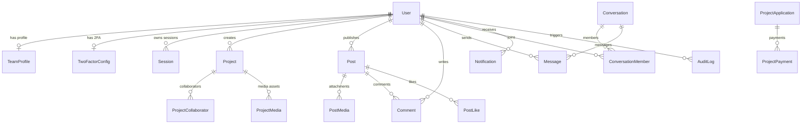

# 🧠 CODEXA AGENCY — CENTRAL PROJECT BRAIN (`brain.md`)
> **Single Source of Truth, Architecture Specification, Data Schema, and Operational Playbook**  
> *Last Updated: 2026-09-10* • *Status: Production Ready* • *Theme: Dark Crimson / Cyber Developer*

---

## 1. Executive Summary & Brand Identity

**CodeXa Agency** is a full-stack digital engineering studio and enterprise software platform. We engineer production-grade digital products, AI-powered systems, cybersecurity solutions, developer tools, SaaS applications, and cross-platform experiences.

- **Brand Name**: CODEXA AGENCY
- **Tagline**: *"Where Ideas Become Digital Reality"*
- **Core Brand Phrase**: `Learn • Build • Deploy • Grow`
- **Core Domains**:
  - Full-Stack Web & Mobile Platforms (Next.js, React, Node.js, Flutter)
  - Artificial Intelligence & Agentic Engineering (EDITH AI, Nexa AI, LLM workflows)
  - Cybersecurity & Ethical Hacking (Hardened Auth, RBAC, Encryption, Linux Systems)
  - Developer Tools & Internal Systems (CodeXa IDE, CodeXa OS, CloudWave)
  - Client Project Incubation & Digital Transformation
- **Production Domain**: `codxa-agency.online`
- **Official Internship & Application Portal**: `https://www.codeaxisapply.xyz`

---

## 2. Technology Stack & Architecture Topology

```text
┌───────────────────────────────────────────────────────────────────────────────┐
│                              CLIENT / BROWSER                                 │
│  Next.js 14 App Router (React 18) • Tailwind CSS 3.4 • Framer Motion 11       │
│  Interactive Canvas & Cyber Overlays • React Easy Crop • Lucide Icons         │
└──────────────────────────────────────┬────────────────────────────────────────┘
                                       │ HTTP / Server Actions / SSE
┌──────────────────────────────────────▼────────────────────────────────────────┐
│                          NEXT.JS APPLICATION SERVER                           │
│  API Routes (Edge & Node.js Runtime) • Iron Session (cxa_session cookie)      │
│  Central Data Store Abstraction (src/lib/data-store.ts)                       │
│  Permissions & RBAC Resolver (src/lib/permissions.ts)                         │
│  Dynamic Advance Calculator Engine (src/lib/project-calculator.ts)            │
│  Razorpay Payment Engine (src/lib/razorpay.ts)                                │
│  TOTP 2FA & Cryptographic Utilities (src/lib/totp.ts)                         │
└──────────────┬───────────────────────────────┬────────────────────────┬───────┘
               │                               │                        │
               ▼                               ▼                        ▼
┌──────────────────────────────┐ ┌──────────────────────────┐ ┌─────────────────┐
│     SUPABASE POSTGRESQL      │ │     SUPABASE STORAGE     │ │  RESEND EMAIL   │
│  Prisma ORM 5.22             │ │  Buckets:                │ │  Transactional  │
│  - Session Pooler (PgBouncer)│ │  - avatars               │ │  Security OTPs  │
│  - Direct Migrations URL     │ │  - project-images        │ │  Notifications  │
│  - Realtime Changefeed       │ │  - post-images           │ │                 │
└──────────────────────────────┘ └──────────────────────────┘ └─────────────────┘
```

### Core Technology Matrix
| Layer | Technology | Purpose / Notes |
| :--- | :--- | :--- |
| **Framework** | Next.js 14.2 (App Router) | Server-side rendering, API endpoints, static generation |
| **Language** | TypeScript 5.6 | Strict type-safety across client and server |
| **Styling** | Tailwind CSS 3.4 + Vanilla CSS | Dark Crimson Cyber palette (`#050505`, `#8B0000`, `#FF1E3C`) |
| **Motion & FX** | Framer Motion 11.11 | Staggered entrance, cyber modals, interactive cards |
| **Database** | PostgreSQL on Supabase | Relational data integrity, foreign keys, transaction pooling |
| **ORM** | Prisma Client 5.22 | Type-safe migrations, auto-generated queries, relational hooks |
| **Authentication** | Iron Session 8 + BCrypt 3 | Stateless encrypted session cookie (`cxa_session`), salt rounds: 12 |
| **Multi-Factor** | TOTP (`otplib`) + Backup Codes | RFC 6238 authenticator app integration, AES-256 secret encryption |
| **Storage** | Supabase Storage API | Public & private media assets (Avatars, Project previews, Feed) |
| **Payments** | Razorpay Node SDK & Checkout | Dynamic booking advance payments in INR, HMAC-SHA256 verification |
| **Email & Comms** | Resend API 6.21 | 6-digit login OTPs, security notifications |
| **Analytics & Telemetry** | Firebase JS SDK 11 & GA4 | Real-time traffic, page views, and event tracking (`G-EZQL4W66WR`) |

---

## 3. Directory Structure & Topology

```text
c:\Users\MYPC\Desktop\codexa\codexa-portfolio
├── .env.example                  # Environment configuration template & secrets schema
├── package.json                  # Dependencies & automated operational scripts
├── tsconfig.json                 # Strict TypeScript configuration
├── tailwind.config.js            # Custom dark crimson / cyber design tokens
├── prisma/
│   ├── schema.prisma             # Universal 29-model Prisma database schema
│   ├── seed.ts                   # Seed script for initial leadership & base entities
│   └── migrations/               # Historical SQL migration steps
├── public/                       # Static public media, brand logos, assets
├── scripts/                      # Operational diagnostics, stress tests, recovery tools
│   ├── auth-diagnose.ts          # Safe diagnostic check of environment and DB state
│   ├── recover-owner-access.ts   # Emergency owner credential & 2FA reset tool
│   ├── seed-test-accounts.ts     # Populates test accounts across all 3 roles
│   ├── db-health.ts              # Connection latency and query stress inspection
│   └── test-chat-concurrency.ts  # Realtime concurrency & message delivery test
└── src/
    ├── app/                      # Next.js App Router root
    │   ├── page.tsx              # High-conversion Agency landing page
    │   ├── layout.tsx            # Global metadata, font configurations, theme wrapper
    │   ├── globals.css           # Global typography, cyber scrollbars, animations
    │   ├── project-request/      # Dynamic Project Application & Requirement Builder
    │   │   ├── page.tsx          # Multi-step intake wizard with Advance Calculator
    │   │   └── success/          # Post-payment confirmation & receipt view
    │   ├── start-project/        # Canonical redirect to /project-request
    │   ├── owner/                # Restricted Owner Command Console (Leads, Accounts, Fin)
    │   ├── admin/                # Admin Management Dashboard (Team, Moderation)
    │   ├── dashboard/            # Team Member Portal (Feed, Chat, Profile, Settings)
    │   ├── feed/                 # Public & Member developer activity feed
    │   ├── team/                 # Public team showcase page
    │   ├── projects/             # Public agency project catalog
    │   ├── login/                # Multi-tier authentication flow (Password + OTP/2FA)
    │   └── api/                  # 22+ RESTful Serverless API endpoints
    ├── components/               # Modular UI Components
    │   ├── ui/                   # Cyber buttons, modals, badges, inputs, tabs
    │   ├── sections/             # Hero, Services, Leadership, Projects, FAQs, Footer
    │   └── feed/                 # Social post creation, comments, like triggers
    ├── config/                   # Static Code-Level Invariant Configurations
    │   ├── leadershipData.ts     # LOCKED canonical text content for Founder, Co-Founder, CEO
    │   └── site.ts               # Brand metadata, phone contacts, external URLs
    └── lib/                      # Core Business Logic & Infrastructure
        ├── data-store.ts         # Universal Data Store (76KB Single Source of Truth)
        ├── db.ts                 # Prisma singleton instance with connection management
        ├── auth.ts               # Iron session management & authentication handlers
        ├── permissions.ts        # RBAC and executive access control rules
        ├── project-calculator.ts # Requirement pricing and dynamic advance calculator engine
        ├── razorpay.ts           # Order generation and HMAC SHA256 signature verification
        ├── supabase.ts           # Supabase client and storage bucket interactions
        ├── totp.ts               # TOTP 2FA secret generation, AES encryption, verification
        └── firebase.ts           # Firebase App & Analytics SDK initialization & tracking
```

---

## 4. Universal Database Schema (Prisma Models)

The database schema (`prisma/schema.prisma`) contains **29 relational models** supporting the entire agency lifecycle:



### Key Models Breakdown
1. **User Accounts & Authentication**:
   - `User`: Core identity, password hash, role (`OWNER` | `ADMIN` | `TEAM_MEMBER`), status flag, avatar crop settings (`cropX`, `cropY`, `zoom`).
   - `TeamProfile`: Public agency profile with `memberType` (`LEADERSHIP` | `CORE_TEAM`), `leadershipPosition` (`FOUNDER` | `CO_FOUNDER` | `CEO` | `TEAM_LEAD`), bios, skills, and links.
   - `TwoFactorConfig`: Encrypted TOTP secret, enabled flag, verified timestamp.
   - `BackupCode`: Hashed single-use recovery codes.
   - `Session`: Active login sessions tracking user-agent, IP, and validity.
   - `AuthOtp`: Time-limited OTP codes for login challenges.
2. **Project Lead Intake & Commercials**:
   - `ProjectApplication`: Comprehensive client project requirement specifications, selected project type, scope checkboxes, computed advance, timeline, client details, status (`NEW` | `IN_REVIEW` | `ACCEPTED` | `IN_PROGRESS` | `COMPLETED` | `REJECTED`).
   - `ProjectPayment`: Financial transactions logged from Razorpay (order ID, payment ID, signature, amount in paise, status).
3. **Agency Projects & Portfolio**:
   - `Project`: Official portfolio works, category, tags, live URLs, repository links, visibility status.
   - `ProjectCollaborator`: Many-to-many relationship linking team members to agency projects.
   - `ProjectMedia`: Screenshots, mockups, and videos attached to projects.
4. **Community & Social Interaction**:
   - `Post`: Micro-articles, developer updates, code snippets, project releases.
   - `PostMedia` / `PostLike` / `Comment`: Multi-image attachments, reactions, threaded discussions.
5. **Realtime Messaging**:
   - `Conversation`: Direct 1-on-1 chats and group channels.
   - `ConversationMember`: Membership list, last read timestamp, mute preferences.
   - `Message`: Encrypted/sanitized text content, file attachments, sender metadata.
6. **Governance & Operations**:
   - `Inquiry`: Contact form submissions from prospective clients.
   - `Notification`: Push/in-app alert queue for actions, mentions, and payments.
   - `ActivityEvent`: Global activity feed recording notable team and system actions.
   - `AuditLog`: Security-sensitive audit trail capturing IP address, actor, action, and diffs.
   - `SiteSetting`: Dynamic system-wide flags (e.g. enabling/disabling sections on home page).

---

## 5. Role-Based Access Control (RBAC) & Security Architecture

### Role Hierarchy
```text
┌─────────────────────────────────────────────────────────────┐
│                       OWNER (@ashu)                         │
│  Absolute system authority: View/manage all leads, manage   │
│  admin accounts, view financial logs, manage access keys,   │
│  toggle site features, execute database diagnostics.        │
└──────────────────────────────┬──────────────────────────────┘
                               │
┌──────────────────────────────▼──────────────────────────────┐
│                  ADMIN / CEO / CO-FOUNDER                   │
│  Executive operations: Review and triage project leads,     │
│  manage team member profiles, moderate social feed & posts, │
│  respond to client inquiries. CANNOT alter Owner account.   │
└──────────────────────────────┬──────────────────────────────┘
                               │
┌──────────────────────────────▼──────────────────────────────┐
│                        TEAM MEMBER                          │
│  Self-service portal: Edit personal profile and skills,     │
│  publish feed updates, participate in team chat channels.   │
└─────────────────────────────────────────────────────────────┘
```

### Security Principles & Hardening
- **Stateless Encrypted Sessions**: Handled via `iron-session` storing sealed user credentials inside the `cxa_session` cookie.
- **Two-Factor Authentication (TOTP)**:
  - Secrets are encrypted with AES-256-CBC using `AUTH_SECRET` before database persistence.
  - Backup codes are hashed using `bcrypt` and invalidated immediately upon use.
- **Strict Canonical Leadership Invariant**:
  - `src/config/leadershipData.ts` holds the locked text content for Founder (Ashu), Deepak (Community Lead), and Venu (CEO).
  - The API explicitly forbids updating text bios/roles of canonical leaders from client requests, ensuring integrity against tampering. Only photo media URLs and crop coordinates are mutable.
- **Safe Diagnostics**:
  - Diagnostic scripts (`auth-diagnose.ts`) never log passwords or secret keys.

---

## 6. Project Requirement Builder & Dynamic Advance Calculator

Clients submit development requests through the `/project-request` interactive portal.

### Calculation Engine Rules (`src/lib/project-calculator.ts`)
1. **Purpose**: Calculates the upfront **Project Booking Deposit / Priority Slot Advance**, not the total estimated project cost.
2. **Project Types & Base Advances**:
   - Personal Portfolio: `₹2,000`
   - Landing Page / Blog: `₹2,500`
   - Business Website: `₹3,000`
   - Agency Website / Corporate: `₹3,500`
   - Community Platform: `₹4,000`
   - Booking / Service Platform: `₹4,500`
   - E-Commerce Platform: `₹5,000`
   - LMS / EdTech Platform: `₹5,500`
   - SaaS Platform / Mobile App: `₹6,000 – ₹7,000`
3. **Dynamic Clamping**:
   - Absolute Minimum Booking Advance: **`₹2,000`**
   - Absolute Maximum Booking Advance: **`₹7,000`**
4. **Client & Server Parity**:
   - The exact same calculation algorithm executes on the client during interactive selection and re-verifies on the server during order creation to prevent client-side price manipulation.

### Razorpay Payment Pipeline (`src/lib/razorpay.ts`)
```text
[Client Wizard] ──▶ [POST /api/payments/create-order] ──▶ [Razorpay REST API]
       ▲                                                          │
       │                                                          ▼
[Checkout Modal] ◀── [Returns order_id, currency, amountInPaise] ─┘
       │
       ▼ (User Pays via UPI / Card / NetBanking)
[POST /api/payments/verify]
       │
       ├──▶ Generates HMAC-SHA256(order_id + "|" + razorpay_payment_id, keySecret)
       ├──▶ Validates cryptographic match with razorpay_signature
       ├──▶ Updates ProjectApplication (status: "ACCEPTED", advancePaid: true)
       └──▶ Logs transaction into ProjectPayment table
```
*Note: In local development or staging environments lacking Razorpay credentials, the system automatically runs an authorized mock order simulator (`order_sim_*`), allowing end-to-end UI and lead pipeline testing without payment failure.*

---

## 7. Operational Playbook & CLI Commands

All development and maintenance tasks should be run from the `codexa-portfolio` root directory:

```bash
# Install dependencies
npm install

# Start local Next.js development server (Turbopack enabled)
npm run dev

# Generate Prisma client types (run after any schema modification)
npm run prisma:generate

# Push schema changes directly to Supabase Postgres
npm run db:push

# Launch Prisma Studio GUI for visual database inspection
npm run db:studio

# Run database seed (Seeds initial owner and foundational profiles)
npm run seed

# Run safe authentication and environment diagnostic check
npm run auth:diagnose

# Production compilation & lint validation
npm run lint
npm run build
npm run start
```

### Emergency & Diagnostic Tooling (`scripts/`)
| Script | Command | Purpose |
| :--- | :--- | :--- |
| **Auth Diagnose** | `npx tsx scripts/auth-diagnose.ts` | Tests database connectivity, counts users, checks role distribution. |
| **Recover Owner** | `npx tsx scripts/recover-owner-access.ts` | Resets owner password and disables broken 2FA configurations. |
| **Seed Accounts** | `npx tsx scripts/seed-test-accounts.ts` | Sets up test credentials for Owner, Admin, and Team roles. |
| **DB Health** | `npx tsx scripts/db-health.ts` | Tests query latency and checks Postgres connection pool health. |
| **Chat Test** | `npx tsx scripts/test-chat-concurrency.ts` | Simulates concurrent chat message deliveries. |

---

## 8. Environment Variables Reference (`.env`)

| Variable | Required | Description / Example |
| :--- | :--- | :--- |
| `NEXT_PUBLIC_APP_URL` | Yes | Local or public app URL (`http://localhost:3000`) |
| `CANONICAL_URL` | Yes | Production canonical domain (`https://codxa-agency.online`) |
| `DATABASE_URL` | Yes | Supabase PostgreSQL connection pooler URI (`...6543/postgres?pgbouncer=true`) |
| `DIRECT_URL` | Yes | Supabase direct database connection URI for migrations (`...5432/postgres`) |
| `SUPABASE_URL` | Yes | Supabase project API gateway (`https://[REF].supabase.co`) |
| `SUPABASE_SECRET_KEY` | Yes | Supabase service role key for storage and administrative actions |
| `SUPABASE_AVATARS_BUCKET`| Yes | Storage bucket name for team avatars (`avatars`) |
| `AUTH_SECRET` | Yes | 32+ character random string for iron-session and TOTP encryption |
| `PASSWORD_MIN_LENGTH` | No | Minimum password length (default: `8`) |
| `BCRYPT_ROUNDS` | No | Salt rounds for password hashing (default: `12`) |
| `RESEND_API_KEY` | Optional| Resend API key for sending email OTP challenges |
| `RAZORPAY_KEY_ID` | Optional| Razorpay public API key (`rzp_live_...` or `rzp_test_...`) |
| `RAZORPAY_KEY_SECRET` | Optional| Razorpay secret key used for HMAC signature generation |
| `INITIAL_OWNER_EMAIL` | Yes | Default owner account email (`ashuchinthapalli3900@gmail.com`) |
| `INITIAL_OWNER_USERNAME`| Yes | Default owner username (`ashu`) |
| `INITIAL_OWNER_PASSWORD`| Yes | Initial password used during first-time database seed |
| `NEXT_PUBLIC_FIREBASE_API_KEY` | Optional | Firebase API Key (`AIzaSy...`) |
| `NEXT_PUBLIC_FIREBASE_PROJECT_ID` | Optional | Firebase Project ID (`codxa-agency`) |
| `NEXT_PUBLIC_FIREBASE_MEASUREMENT_ID` | Optional | Google Analytics 4 Measurement ID (`G-EZQL4W66WR`) |

---

## 9. Architectural Invariants & Non-Negotiables

1. **Security & Secrets**:
   - Never commit `.env` or `.env.local` to git.
   - Client components must NEVER import `@prisma/client`, `bcryptjs`, service account credentials, or private secrets.
2. **Permanent Founder & Super Admin Invariant**:
   - `ashuchinthapalli3900@gmail.com` is the permanent Founder, Owner, and Super Admin of CodeXa Agency.
   - The Founder account is permanently mapped to `role = "OWNER"` and cannot be deleted, demoted, deactivated, or overridden by any API or client action.
3. **Canonical Leadership Single Source of Truth**:
   - The public website renders exactly ONE canonical leadership section (`PublicLeadershipSection`) connected directly to the database via `/api/leadership/public`.
   - All duplicate public leadership card sections and detailed directory layouts have been removed.
   - Leadership profiles (bios, quotes, roles, skills, display order, public visibility, photos) are managed directly inside the main Admin/Owner Dashboard.
4. **Firebase Authentication Architecture**:
   - Google Sign-In uses Firebase Authentication (`GoogleAuthProvider`, `signInWithPopup` with `signInWithRedirect` fallback).
   - The client exchanges Firebase ID tokens with `/api/auth/firebase-session`, which verifies identity using Firebase Admin SDK and binds verified emails to database roles in secure HttpOnly cookies (`cxa_session`).
   - Unauthorized accounts are blocked from administrative routes with clear guidance.
5. **Database Performance**:
   - When connecting through serverless functions, always use `DATABASE_URL` with transaction pooling enabled (`pgbouncer=true`). Use `DIRECT_URL` only for CLI migrations.
6. **Advance Calculator Parity**:
   - Any modifications to the pricing matrix in `src/lib/project-calculator.ts` must maintain complete logic symmetry between frontend previews and backend validation.
7. **Design System Harmony**:
   - Adhere strictly to the dark crimson / cyber aesthetic: jet black backgrounds (`#050505`, `#080808`), dark crimson (`#8B0000`), neon red (`#FF1E3C`), frosted glassmorphism overlays, and Orbitron / Inter / JetBrains Mono typography.
