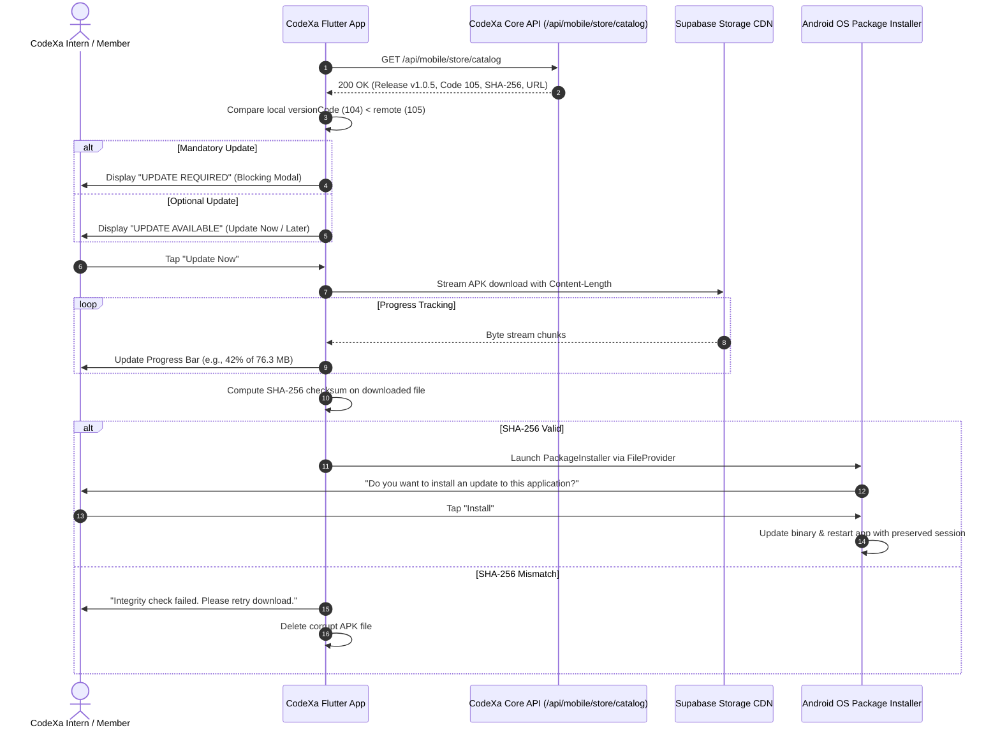

# CodeXa Android In-App Update Flow & Installation Guide

**Client:** CodeXa Mobile Flutter Application  
**Package Name:** `online.codxa_agency.app`  
**Distribution Engine:** Built-in in-app CodeXa Store  
**Android Platform Compatibility:** Android 8.0 (API 26) through Android 15 (API 35)

---

## 1. Architectural Principles

1. **Integer Version Codes Over Lexicographical Strings:**
   - Comparisons are strictly numerical:
     `isUpdateAvailable = (remoteVersionCode > localVersionCode)`
   - Version strings (`1.0.5` vs `1.0.4`) are display-only.
2. **Cryptographic Integrity Verification:**
   - The downloaded APK's SHA-256 digest is calculated on-device using `crypto.sha256`.
   - If the hash differs from the published record in PostgreSQL, installation is blocked, the corrupt binary deleted, and the user notified.
3. **No Silent Installation:**
   - All installations launch Android's system package installer via `Intent.ACTION_VIEW` and Android `FileProvider`.
   - Requires explicit user consent, adhering to Google Android OS security requirements.
4. **Data Continuity:**
   - As long as the APK is signed with the official CodeXa Agency release keystore, updating retains all local user session data, active logins, offline drafts, and cache.

---

## 2. In-App Update Sequence



---

## 3. Android Configuration Requirements

### 3.1 `AndroidManifest.xml` (Permissions & Provider)

```xml
<manifest xmlns:android="http://schemas.android.com/apk/res/android"
    package="online.codxa_agency.app">

    <!-- Network permissions for downloading releases & streaming videos -->
    <uses-permission android:name="android.permission.INTERNET" />
    <uses-permission android:name="android.permission.ACCESS_NETWORK_STATE" />
    
    <!-- Required on Android 8.0+ for sideloading updates -->
    <uses-permission android:name="android.permission.REQUEST_INSTALL_PACKAGES" />

    <application
        android:label="CodeXa"
        android:icon="@mipmap/ic_launcher">

        <!-- FileProvider for secure APK URI sharing with Android Package Installer -->
        <provider
            android:name="androidx.core.content.FileProvider"
            android:authorities="${applicationId}.fileProvider"
            android:exported="false"
            android:grantUriPermissions="true">
            <meta-data
                android:name="android.support.FILE_PROVIDER_PATHS"
                android:resource="@xml/file_paths" />
        </provider>

    </application>
</manifest>
```

### 3.2 `res/xml/file_paths.xml`

```xml
<?xml version="1.0" encoding="utf-8"?>
<paths xmlns:android="http://schemas.android.com/apk/res/android">
    <external-cache-path name="external_cache" path="." />
    <cache-path name="cache" path="." />
    <files-path name="files" path="." />
</paths>
```

---

## 4. Push Notification Triggering (`APK_RELEASE_PUBLISHED`)

When a release is published via `/api/admin/apps/mobile/releases/publish`, Firebase Cloud Messaging sends a data & notification message to the `codexa-releases` topic:

```json
{
  "notification": {
    "title": "CodeXa Update Available",
    "body": "Version 1.0.5 is ready with enhanced features and performance."
  },
  "data": {
    "type": "APK_RELEASE_PUBLISHED",
    "versionName": "1.0.5",
    "versionCode": "105",
    "channel": "stable",
    "click_action": "FLUTTER_NOTIFICATION_CLICK",
    "route": "/store"
  }
}
```

The Flutter FCM background and foreground listeners navigate straight to `CodeXaStoreScreen` when the notification is tapped.
